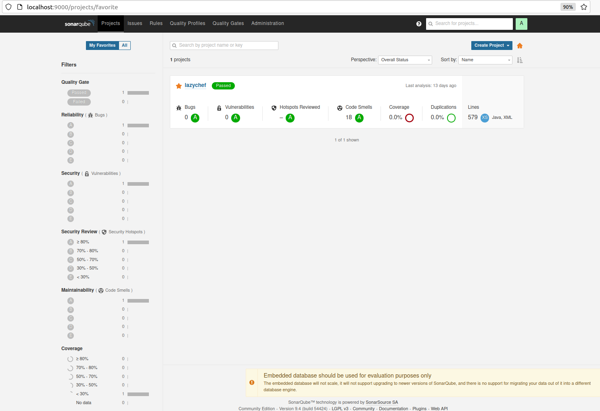
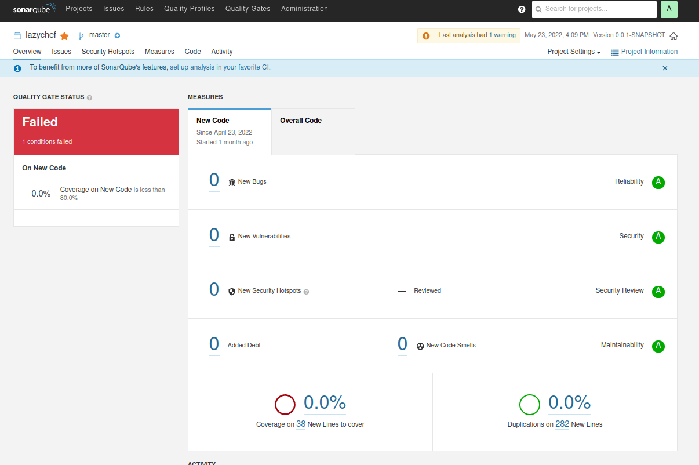

:toc:
:toclevels: 3

= API section

:sectnums:

== API
=== Main information
In order to maintain quality of the code, we added static code analysis.
There is two possibilities to check it. First (mostly local) option is to run SonarQube. Second CodeQL is running always at push to remote repository.

=== SonarQube
To run SonarQube, you need to do a few steps:

* Download sonarqube (we used `sonarqube-9.4.0.54424` version)
** unpack it
** run terminal and go to folder specific to your device and then run (`bin -> system`)
** then run the command: `./sonar.sh start`

* Open `lazychef` project, then in terminal or mvn commands pop window type:
`mvn clean verify sonar:sonar -Dsonar.projectKey=lazychef -Dsonar.host.url=http://localhost:9000/ -Dsonar.login=token` where you have to generate your token.

For tests we use this: `255adb2ab989cf7bbc8e4926f07ceb2a5743ec22`.

* Open browser and go to
** `http://localhost:9000/`

* After successful login you will see:

* Then if you click on the name of the project you can see more specific information:

There is a lot of information about code quality, test coverage and others.