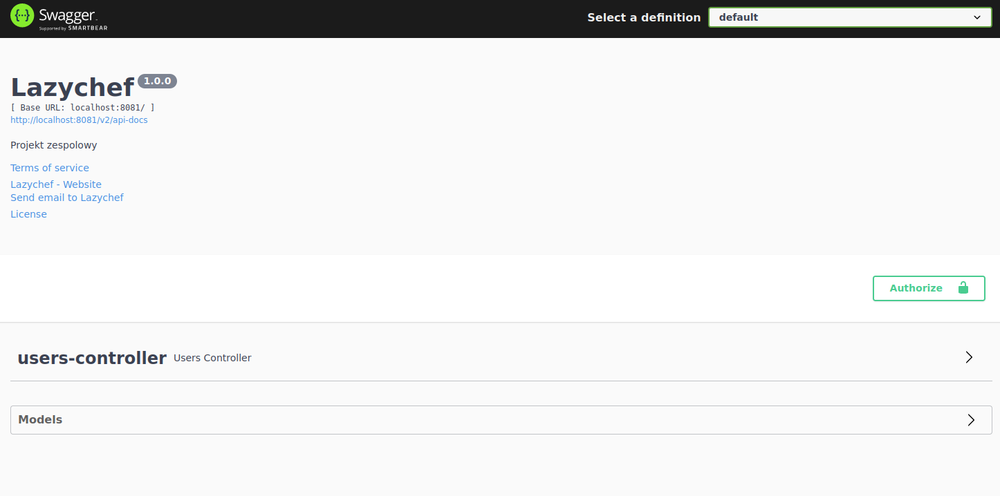
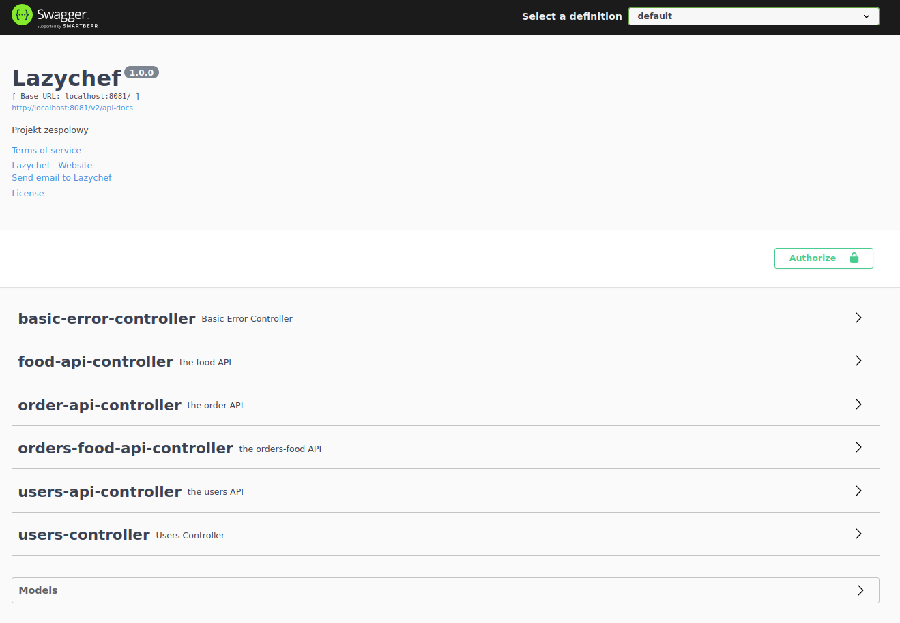

:toc:
:toclevels: 3

= API section

:sectnums:

== API
=== Main information
Swagger is a helpful tool to maintain and managing application, it is used to check/test newly added endpoints or services.

=== Configure
For our use, it is configured to show only our and implemented endpoints.

If you want to configure it to see API, by which we communicate the sides of project, you need to change this line in a `SwaggerConfig` file

[source]
apis(RequestHandlerSelectors.withClassAnnotation(RestController.class))

To this:

[source]
apis(RequestHandlerSelectors.any())

Our configuration looks like this:

After line change it will be:

=== How to use
